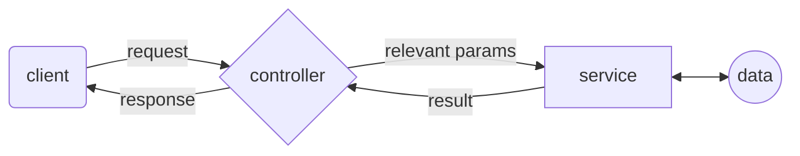
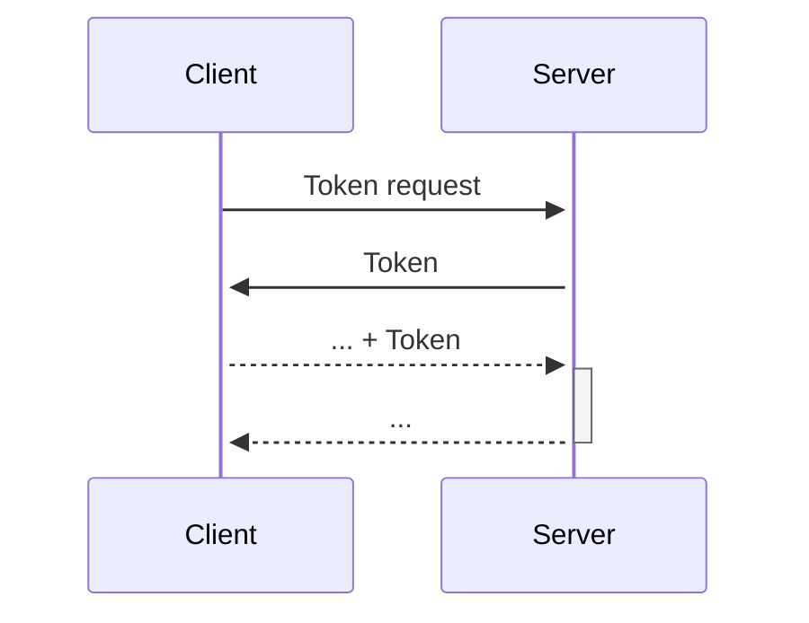

# Social Media - Facebook like - FooBar

Foobar is a social media application inspired by platforms like Facebook. It provides both a web client and an Android app for users to connect and share updates. 
This program consist 4 parts: 
1. [TCP server](https://github.com/MeitarTeper/SocialMedia-TCP-Server)
2. API server
3. web client
4. [Android client](https://github.com/MeitarTeper/SocialMedia-Android)

Notice that the TCP server and the Android client are in different repositories, while the API server and the web client code are in this repository.
#### You can find the full explanation of this project in the Wiki.

### Application security
In order to maintain the security of our application, we connect our application to a Bloom Filter data which contains problematic links. Every time a user wants to upload a post that contains a link, it will be checked and uploaded only if the link is safe.

### Application authors 
[Shahar Chen](https://github.com/Shahar2612)  
[Yaara Sirkis](https://github.com/YaaraSirkis)  
[Meitar Teper](https://github.com/MeitarTeper) 

# Build and run the program

To execute the full program you need to run first the TCP server, then the API server with the web client and in the end the Android client. 

### Dependencies

This project requires the following dependencies:

* [Node.js](https://nodejs.org/en/) - JavaScript runtime environment
* [npm](https://www.npmjs.com/) - Package manager for JavaScript
* [React](https://reactjs.org/) - JavaScript library for building user interfaces
* [MongoDB](https://www.mongodb.com/) - NoSQL database

### Installation

Clone the repository: 
```bash
git clone https://github.com/MeitarTeper/SocialMedia.git
```

Download the necessary dependencies for both the web-client and the server separately.
first navigate to the web-client by writing 'cd web-client' and run the commend below. Then open a new terminal and navigate to the server by writing 'cd server' and run the commend below.

```
npm i --force
```
### Executing The Program

To run the API server and the web client programs, navigate to the server directory, and run the following command:

```bash
npm start
```

if you are using mac, run the following command:

```bash
npm run yaara
```

then open [http://localhost:8080](http://localhost:8080) 
to view it in your browser.

* #### When running the server, if the MongoDB is empty, it will insert automatically the default posts and users. If there is any problem, you can find the posts.json, and users.json on ./server


# API Server

The server is built on Node.js and Express.js. It's responsible for handling the client's requests, and communicating with the database and the TCP server.

The server exposes it's functionality through a REST API. Here's a list of the API's endpoints:

| Endpoint | Method | Description |
|----------|--------|-------------|
| /api/token | POST | Returns a JWT token for the user |
| /api/users | POST | Registers a new user |
| /api/users/:email | GET | Returns the user's information |
| /api/users/:email | PATCH | updates the user's information |
| /api/users/:email | DELETE | Deletes the user |
| /api/users/:email/friends | GET | Returns the user friends |
| /api/users/:email/friends | POST | Send a new friend request to the user |
| /api/users/:email/friends/:fid | GET | Accept a friend request |
| /api/users/:email/friends/:fid | DELETE | Deletes a user from the friends list |
| /api/users/:email/friendRec/:fid | DELETE | Decline friend request |
| /api/users/:email/posts | GET | Returns the user's posts|
| /api/users/:email/posts | POST | Creates new post|
| /api/users/:email/posts/:fid | DELETE | Deletes a post|
| /api/users/:email/posts/:fid | POST | Creates a new comment|
| /api/users/:email/posts/:fid | PATCH | Updates a post|
| /api/users/:email/comments/:cid | GET | Returns the comment's information|
| /api/users/:email/posts/:pid/:cid | DELETE | Deletes a comment|
| /api/users/:email/posts/:pid/:cid | PATCH | Updates a comment|
| /api/posts | GET | Returns 25 posts|

**Note:** besides the first two endpoints, all the other endpoints require the user to be authenticated. The authentication is done by sending the JWT token in the request's header.

## Server Architecture
The server is designed using the MVCS architecture (except for the view, since there is no user interface). Here's a simple diagram of the server's architecture:



### Notes

- According to the assignment instructions, when a user logs in and reaches the main page, the application displays up to 25 posts. Five of these posts are from users who are not friends with the logged-in user, while the remaining posts are from friends of the user. This ensures a diverse and dynamic feed for a better user experience.

- The android client supports english, textual messages only (only ascii charachters)

- The posts date times show up with times from the GMT+2 time zone


# Web Client workflow

The client is built on React. It is responsible for displaying the user interface, and communicating with the server.

There is one thing to note about the client's workflow. When a user logs in, the server returns a JWT token. The client then stores this token in local storage, and uses this token to authenticate the user in every request to the server. When the user logs out, the client deletes the token from the local storage.



# What can you do?
## log in and register
First, you need to click on the create new account button that will navigate you to the register page were you can create an account.


make sure you fill your personal information correctly!

 

After you register you can log-in and use FooBar, make sure you fill your personal information correctly


## The FooBar feed
After you log-in you will be navigate to your feed. 

https://github.com/Shahar2612/ProjectPart2-Web/assets/129045321/fe0bd287-3907-49dd-b6ac-71bc89c150e7

* You can like and unlike a post, etc.
* You can see the comment and the share menu.

https://github.com/Shahar2612/ProjectPart2-Web/assets/129045321/c1e8bdef-c0aa-4d02-ba7e-5b0662ddc8da

### Edit user
* You can edit your user name and picture if you click on the edit img in the up menu (next to your picture in the up menu).

https://github.com/Shahar2612/ProjectPart2-Web/assets/129045321/9d9f302f-4119-4de2-b4ec-9106267a1ea5

### Posts
* You can add, edit and delete posts only if the posts is yours.

https://github.com/Shahar2612/ProjectPart2-Web/assets/129045321/ef8da6e0-0a40-4891-bbd5-15c4fcc73987

https://github.com/Shahar2612/ProjectPart2-Web/assets/129045321/c409abd1-fe2d-4df6-a76e-bcfb819fa049

* If your post contain link or URL which is not safe - a message will be displayed to the user and the post will not be uploaded or updated.


### Comments
* You can add, edit and delete comments only if the comments is yours. 

https://github.com/Shahar2612/ProjectPart2-Web/assets/129045321/3a152bb7-0f4b-4875-914c-f9f3acec4579

### Log-out and delete account
* You can log out or delete your account if you click on your picture in the up menu.

https://github.com/Shahar2612/ProjectPart2-Web/assets/129045321/447fdcff-3c5c-4d4d-8797-86ab31a80348

### light mood to dark mood
* You can change light mood to dark mood if you click on the moon img.

https://github.com/Shahar2612/ProjectPart2-Web/assets/129045321/3f9b1f9d-53d0-4920-97bc-e2022a886145

### Friends requests
* You can see your friends requests list if you click on the grup img in the middel of the up menu. There you can also approve or decline the requests.

https://github.com/Shahar2612/ProjectPart2-Web/assets/129045321/a0582f51-183f-497f-9999-a3994ef68d21

## Profile page
### Your profile page
* You can navigate to your profile page by clicking your user name on the left menu.
There, you can see your friends and your posts

https://github.com/Shahar2612/ProjectPart2-Web/assets/129045321/ee1f12bb-66ba-48d3-8aea-3c8094a075ab

### Friends profile page
* You can click on the name or picture in each post and get to the personal profile page of the author of the post, where you can also send a friend request or if you are already friends - see the user posts, friends list and an option to delete the user from your friend list.

https://github.com/Shahar2612/ProjectPart2-Web/assets/129045321/af647cb2-894b-4030-932a-0476f13fcc00


